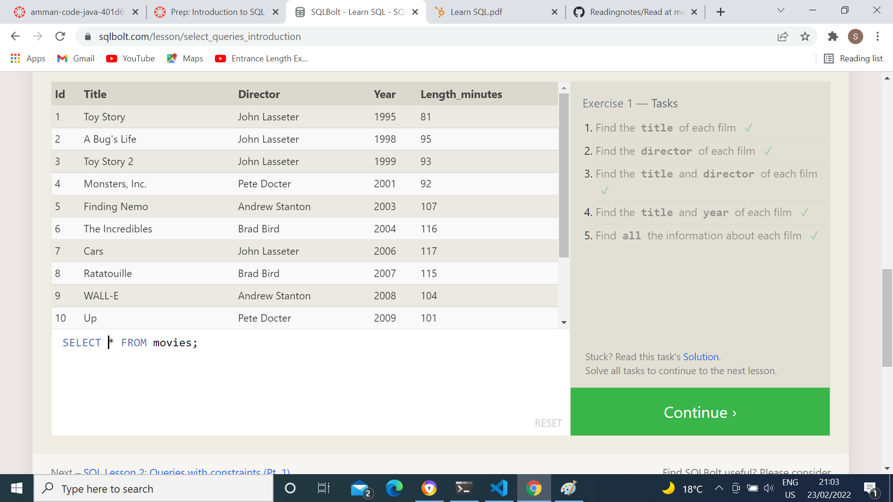
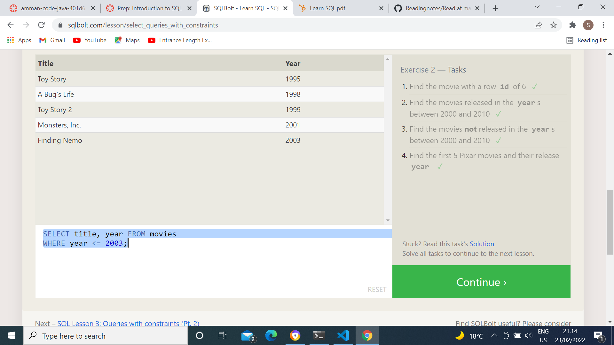
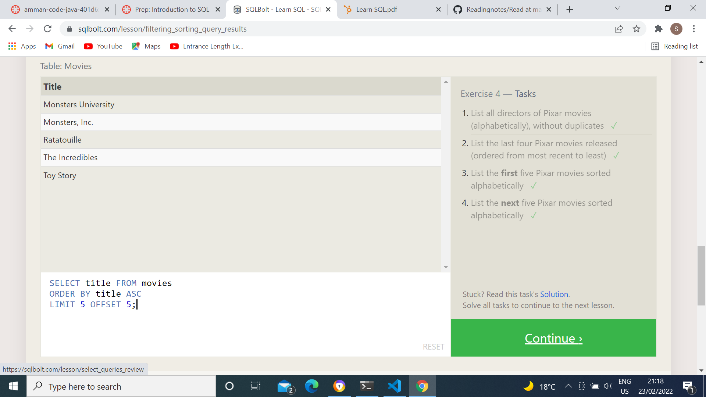
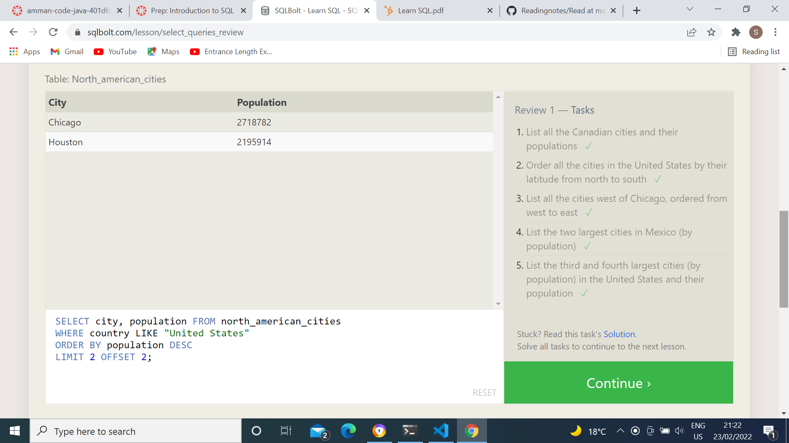
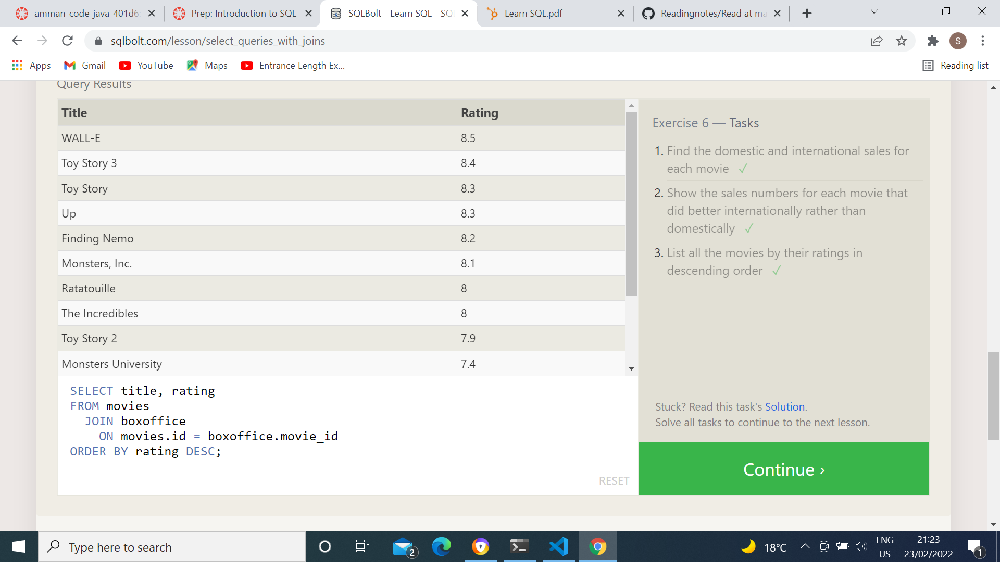
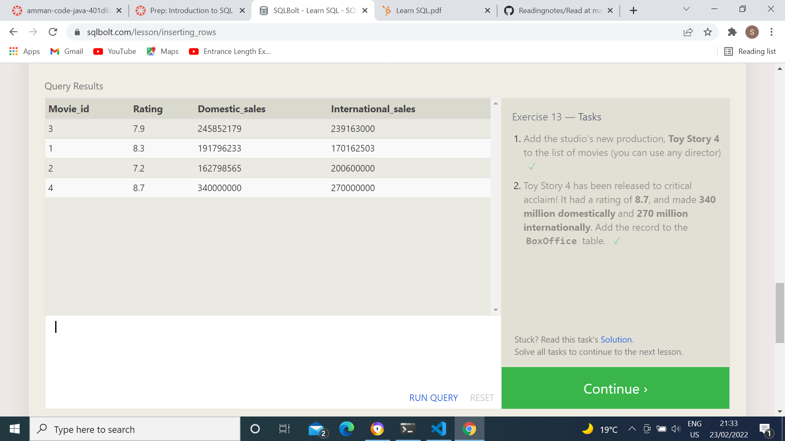
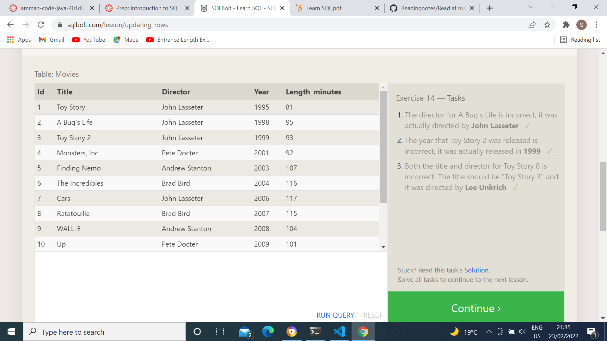
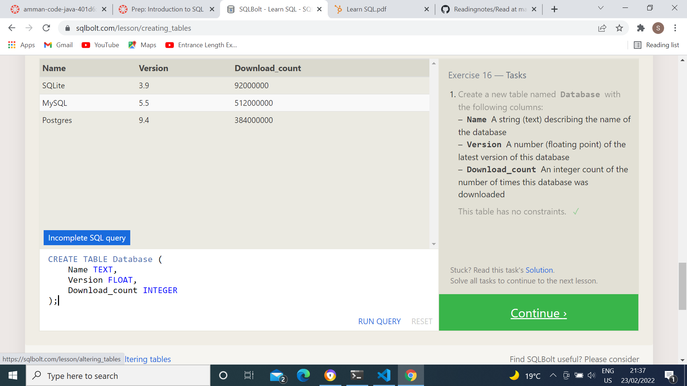
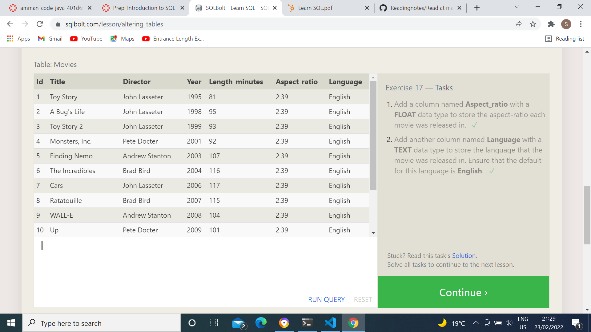
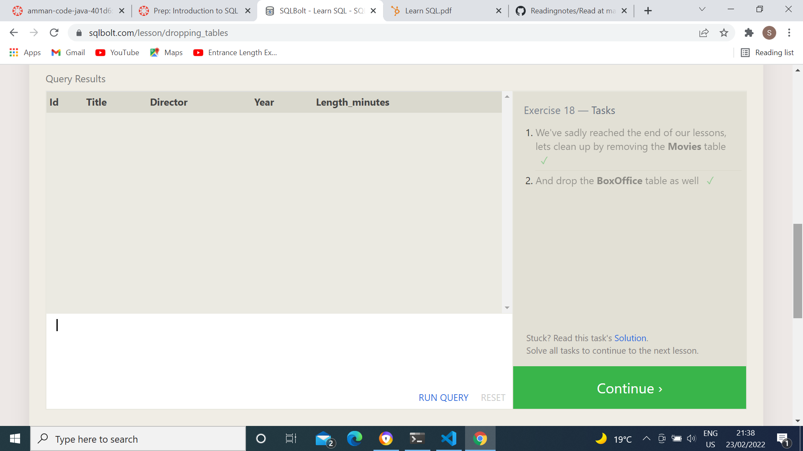

# SQL
Data Base is a place that we storage our indoromation inside its it looks like a collection of tables joind toghther with a relations
to deal with this tables we have to use sql its a language allow us to sear and access these tables as an example if we want to access any coloumn inside cercain table we can serec for it by the select statment and some of condations so its very useful langauge 

- exercise 1

- exercise 2

- exercise 3

- exercise 4

- exercise 5

- exercise 6

Data Base Manegment :

- exercise 13

- exercise 14

- exercise 15

- exercise 16

- exercise 17

- exercise 18
